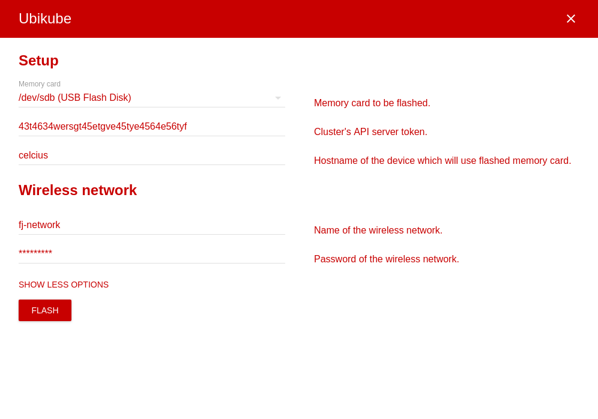

# Ubikube
Electron app flashing card images.

## Setup
Just run:

```
git clone git@github.com:maciaszczykm/ubikube.git
cd ubikube
npm i
sudo env PATH="$PATH" npm start
```

## Interface
<p align="center">
    
</p>

## Possible enhancements

- Add build files.
- Move from CSS to SCSS.
- Add `cloud-init` scripts after image flash.
- Update progress bar on image flash.
- Read fields before flash process (currently it's hardcoded).
- Add validation.
