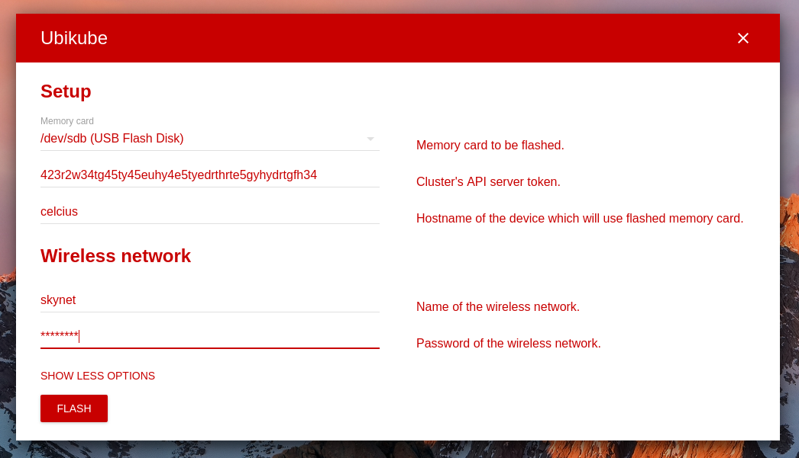
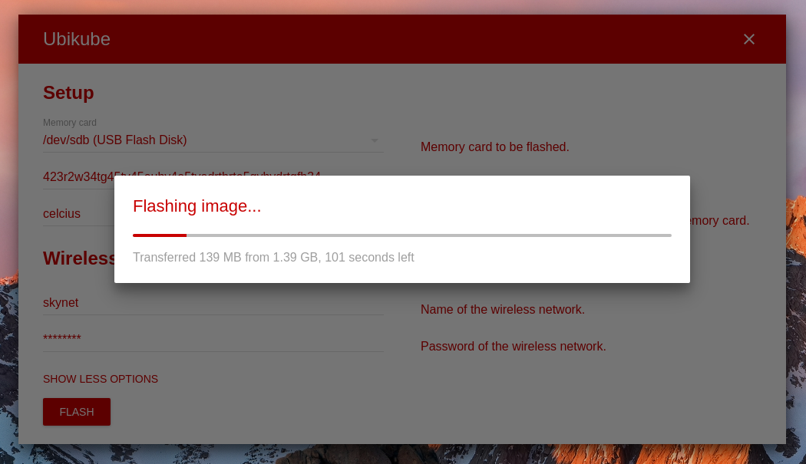

# Ubikube
Application flashing cards for microcontrollers.

## Setup
Just run:

```
sudo apt-get install p7zip-full
git clone https://github.com/fest-research/ubikube.git
cd ubikube
npm i
sudo env PATH="$PATH" npm start
```

## Tools

- File formatting - `npm run format`

## Interface
<p align="center">
    
    
</p>

## Possible enhancements

- Use `electron-compile` or other tool for building (SCSS and JS)?
- Remove unnecessary dependencies from `package.json`.
- Update file formatter to match app style.
- Add validation.
- Update image after flashing it.
- Add `npm` module to run in `sudo` mode.
