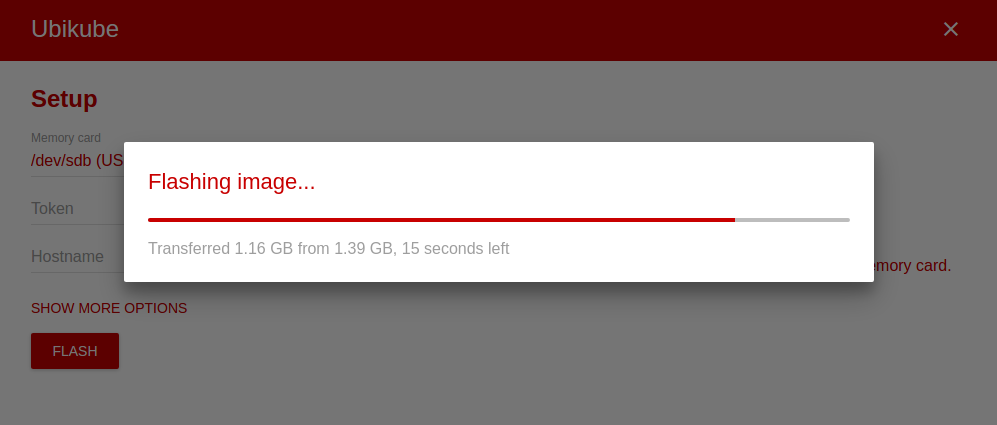

# Ubikube
Electron app flashing card images.

## Setup
Just run:

```
git clone git@github.com:maciaszczykm/ubikube.git
cd ubikube
npm i
sudo env PATH="$PATH" npm start
```

## Interface
<p align="center">
    
    
</p>

## Possible enhancements

- Add build files.
- Move from CSS to SCSS.
- Remove unnecessary dependencies from `package.json`.
- Add file formatters.
- Add validation.
- Update image after flashing it.
- Add `npm` module to run in `sudo` mode.
